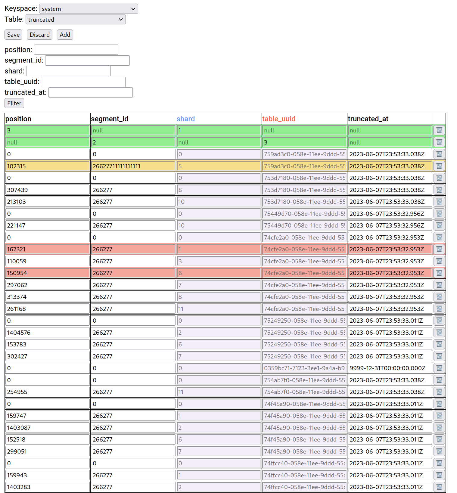

# cql-ui

cql-ui is a web-based interface for interacting with CQL databases like Cassandra or ScyllaDB.



## Getting Started

### Prerequisites

- Node.js
- CQL Database

### Server

1. Install server dependencies:

   ```
   cd ./cassandra-server
   npm install
   ```

2. Start the server

    ```
    SERVER_PORT=7777 NODE_CONTACT_POINT=172.18.0.7 LOCAL_DATA_CENTER=datacenter1 node server.js
    ```

    Replace 172.18.0.7 with the actual contact point IP address of your NoSQL database cluster.

### Client

1. Install client dependencies

    ```
    cd ./cql-ui
    npm install
    ```

2. Start the client

    ```
    npm start
    ```

    This will start the cql-ui client on your local development server.

### Usage

1. Open your web browser and navigate to http://localhost:3000.
2. Choose the keyspace
3. Choose the table
4. Start editing

* Press "Save" to save the changes
* Press "Add" to add a new editable row
* Press "Discard" to discard all changes made to a table
